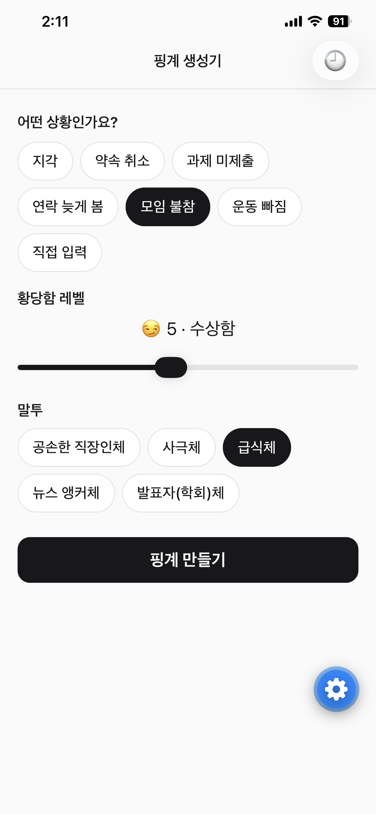
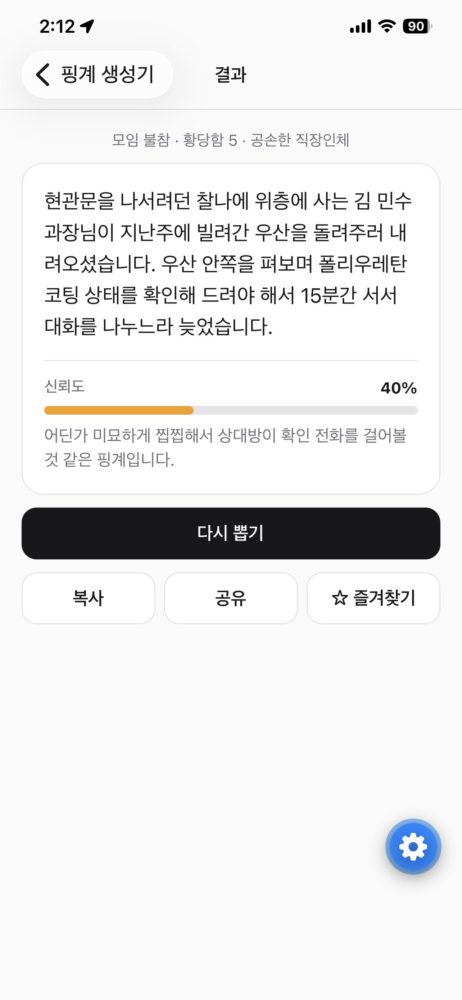
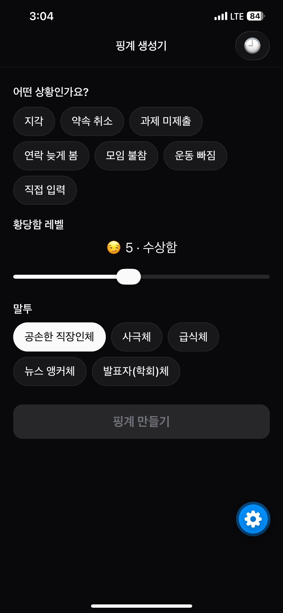
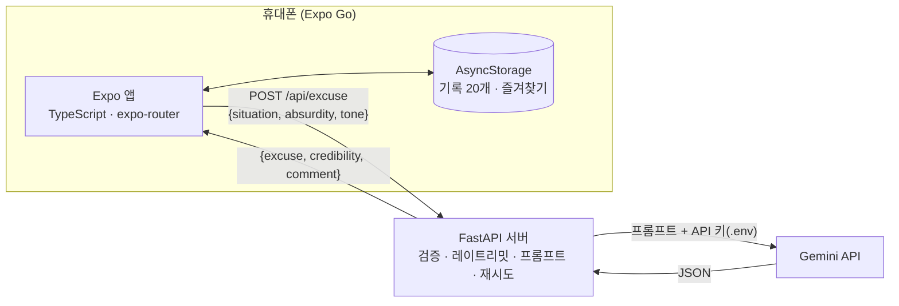

# 핑계 생성기

> 상황·황당함 레벨·말투만 고르면, LLM이 웃기고 그럴듯한 핑계와 "신뢰도 점수"를 만들어주는 모바일 앱

Expo(React Native) 앱 + FastAPI 서버 + Gemini API로 만든 작은 풀스택 프로젝트입니다. 요구사항은 [PRD.md](PRD.md), 구현 중 내린 결정은 [DECISIONS.md](DECISIONS.md)에 기록했습니다.

## 스크린샷

| 홈 | 결과 | 기록 | 다크 모드 |
| --- | --- | --- | --- |
|  |  |  |  |

## 주요 기능

- **상황 선택**: 지각·약속 취소·과제 미제출 등 6개 + 직접 입력(최대 50자)
- **황당함 레벨 1~10**: 1~3 현실적 / 4~6 수상함 / 7~9 황당 / 10 우주적. 레벨 1과 10의 결과가 확연히 다르다
- **말투 5종**: 공손한 직장인체, 사극체, 급식체, 뉴스 앵커체, 발표자(학회)체
- **신뢰도 게이지**: 0~100% 게이지와 점수에 어울리는 한 줄 코멘트
- **다시 뽑기**: 같은 조건으로 재생성, 직전 핑계와 겹치지 않게 요청
- **복사·공유**: 클립보드 복사, OS 공유 시트(카카오톡 등)
- **기록·즐겨찾기**: 최근 20개 자동 저장, 별표한 핑계는 무제한 보관, 스와이프 삭제 (기기에만 저장)
- **다크 모드**, 레이트리밋(IP당 분당 10회·일 200회), 오프라인/서버 다운 시 에러 문구

## 아키텍처



| 영역 | 기술 |
| --- | --- |
| 앱 | Expo SDK 57, TypeScript(strict), expo-router, AsyncStorage, expo-clipboard |
| 서버 | Python, FastAPI, Pydantic v2, uvicorn, python-dotenv |
| LLM | google-genai SDK (`gemini-3.5-flash-lite`) |
| 테스트 | pytest + FastAPI TestClient (LLM은 가짜 함수로 대체, 46개) |

### API 키를 서버에만 둔 이유

앱 번들에 들어간 값은 누구나 꺼내 볼 수 있습니다. `EXPO_PUBLIC_` 환경변수도 빌드 시점에 코드에 그대로 박히기 때문에 비밀이 아닙니다. 그래서 앱은 **서버 주소만** 알고, LLM 호출과 API 키는 서버가 전담합니다.

- 키는 로컬에서는 `server/.env`, 배포 서버에서는 Render 환경변수에만 둔다. `.env`는 `.gitignore`로 커밋에서 제외하고, `.env.example`·`render.yaml`에는 키 이름만 적는다
- 키를 서버에 두면 **레이트리밋·입력 검증·프롬프트 관리**도 서버 한 곳에서 할 수 있다. 앱을 다시 배포하지 않고 프롬프트를 고칠 수 있다
- 로그에는 시간·레벨·말투·응답 시간·에러 코드만 남기고, 사용자가 입력한 텍스트와 키는 남기지 않는다

## 기술적으로 고민한 점

### 1. "LLM에게 맡길 것"과 "서버가 정할 것"을 나누기

처음에는 신뢰도 점수와 소재 선택까지 전부 프롬프트로 LLM에게 맡겼습니다. 샘플 18개(상황 3 × 레벨 1·5·10 × 말투 2)를 뽑아 직접 읽어 보니 문제가 보였습니다.

- **신뢰도가 85 / 45 / 1로 고정**: "레벨 1~3은 70~95" 같은 범위를 줘도 LLM은 매번 범위 가운데 숫자를 골랐다
- **레벨 10이 평행우주·양자역학·웜홀로 쏠림**: 프롬프트 예시("평행우주의 내가…")를 계속 따라 했다

LLM은 "범위 안에서 고르게 랜덤"을 잘 못 하지만, 코드는 그 일을 정확히 합니다. 그래서 **랜덤성이 필요한 결정은 서버가 내리고, LLM에게는 결과만 알려주는** 구조로 바꿨습니다.

- **신뢰도**: 서버가 레벨별 범위(1~3: 70~95, 4~6: 30~70, 7~9: 5~30, 10: 0~5)에서 `random.randint`로 뽑아 프롬프트에 넘긴다. LLM은 그 점수에 어울리는 코멘트만 쓰고, 응답의 `credibility`는 LLM이 무엇을 보내든 서버 값을 쓴다
- **소재·과장 방법**: 서버가 레벨 구간별 소재 후보와 (레벨 7~9는) 과장 방법 후보 중 하나씩 골라 프롬프트에 넘긴다 (아래 2번)
- 재시도할 때도 같은 점수·소재·과장 방법을 써서 결과가 일관된다. 모두 단위 테스트로 범위와 랜덤성을 확인한다

### 2. LLM이 프롬프트 예시를 그대로 따라 하는 문제

프롬프트에 레벨별 예시 장면을 하나씩 넣었더니, LLM이 그 장면을 거의 그대로 반복했습니다.

| 레벨 | 프롬프트 예시 | 실제로 반복된 결과 |
| --- | --- | --- |
| 1 | 버스가 배차 간격보다 15분 늦게 왔다 | 5번 생성 중 5번 버스 지각 |
| 5 | 앞사람이 동전 87개로 계산해서 같이 세어 드렸다 | 샘플 실행 3번 모두 편의점 동전 세기 |
| 10 | 평행우주의 내가 대신 출근한 줄 알았다 | 평행우주·양자역학·웜홀 반복 |

예시를 "참고만 하라"고 적어도 소용이 없었습니다. 그래서 두 가지를 바꿨습니다.

- **프롬프트에서 특정 장면 예시를 모두 뺐습니다.** 레벨 4~6이면 "평범한 사건 하나 + 과하게 구체적인 디테일"처럼 **원칙만** 남겼습니다. 장면 예시가 다시 들어가지 않도록 테스트로 막습니다
- **소재는 서버가 고릅니다.** 레벨 구간마다 후보 목록을 두고 서버가 하나를 랜덤으로 넘깁니다. 레벨 1~3은 교통·알람·업무·날씨·집안일 등 12개입니다. 4~6은 이를 재사용하되 과장하면 병명·응급실로 번지기 쉬운 "컨디션"을 빼고, 7~9는 여기에 "동물"을 더합니다. 10은 시간여행·외계인·꿈이 현실이 됨 등 12개입니다. 같은 소재라도 레벨이 높을수록 더 과장하도록 프롬프트가 안내합니다

그 결과 레벨 1을 10번 생성하면 8가지 소재로 나뉘고, 버스는 0번이 됐습니다.

레벨 7~9는 현실적인 소재를 받으면 오히려 현실 쪽으로 끌려가서, 레벨 8을 10번 생성했을 때 5개가 레벨 5처럼 밋밋했습니다. 그래서 **"과장 방법"도 서버가 고릅니다.** 후보는 터무니없는 우연, 비현실적인 규모(원래 있던 사람·물건이 수십·수백), 동물·사물의 엉뚱한 개입, 작은 일의 연쇄입니다. 프롬프트에는 "레벨 4~6보다 확실히 황당해야 한다"는 기준을 넣었습니다. 밋밋한 결과는 0개로 줄었지만, 이번에는 "우산이 저절로 늘어남"처럼 레벨 10 쪽으로 넘어가는 경우가 생겼습니다. 그래서 "물건이 저절로 생기거나 늘어나는 것, 기계가 의지를 갖는 것은 레벨 10"이라는 경계를 추가했습니다.

### 급식체 유행어는 `slang.py`만 고치면 바뀐다

급식체일 때 서버가 [`server/slang.py`](server/slang.py)의 `SLANG` 목록에서 50% 확률로 유행어 하나를 골라 **뜻·쓰임 예시와 함께** 프롬프트에 넘깁니다. LLM은 뜻에 맞는 자리에 한 번만 넣습니다. 유행어를 추가·삭제하거나 뜻을 고칠 때는 이 파일만 고치면 되고, 프롬프트나 다른 코드는 건드릴 필요가 없습니다.

```python
Slang(expression="엄..", meaning="말문이 막히거나 어이없을 때 문장 앞에 붙이는 추임새", usage="엄.. 나도 내가 왜 늦었는지 모르겠음"),
```

유행어를 넣더라도 "실존 인물·팀·집단을 언급하거나 놀리지 않는다"는 안전 규칙은 그대로 적용됩니다.

### 3. 프롬프트 규칙 + 서버 검사 + 1회 재시도

안전 규칙과 말투 규칙을 프롬프트에 적어도 확률적으로 새어 나왔습니다. 실제로 샘플을 돌렸을 때 이런 결과가 나왔습니다.

- 공손한 직장인체인데 "…늦었**사옵니다**"로 끝나는 말투 섞임
- 코멘트에 "**48점짜리** 핑계답게…" 같은 점수 언급
- 시간여행 소재에서 "**세종대왕**"처럼 실존 인물 등장

그래서 LLM 응답을 서버가 한 번 더 검사합니다. 위반이면 JSON 파싱 실패와 똑같이 취급해 **1회 재시도**하고, 두 번 다 실패하면 `502 LLM_ERROR`를 돌려줍니다.

```text
Gemini 응답 → 코드펜스 제거 → JSON 파싱 → Pydantic 검증(길이 등)
           → 코멘트에 숫자/점수 표현? → 사극체가 아닌데 사극 어미? → 실존 인물 이름?
           → 하나라도 걸리면 재시도 (최대 2번, 전체 15초 타임아웃)
```

- 검사는 정규식이라 빠르고 테스트하기 쉽다. 하지만 실존 인물 목록처럼 **모든 경우를 막을 수는 없다**. 그래서 프롬프트 규칙을 1차 방어선으로 두고, 서버 검사는 실제로 자주 새던 패턴만 막는 보조 장치로 썼다
- 15초 타임아웃은 재시도를 **포함한 전체**에 걸어, 앱의 20초 타임아웃 안에 항상 끝나게 했다
- 테스트에서는 실제 LLM을 부르지 않고, 응답을 흉내 내는 가짜 함수로 파싱·재시도·에러 코드·레이트리밋을 검증한다

### 4. 프롬프트 품질은 사람이 읽어서 확인

`server/scripts/sample_excuses.py`가 실제 Gemini로 18개를 한 번에 출력합니다. 프롬프트를 고칠 때마다 이 스크립트로 레벨 차이, 말투 유지, 레벨 4~6이 "현실에서 있을 법한 사건 1개 + 과한 디테일"에 머무는지를 눈으로 확인했습니다.

## 실행 방법

### 준비물

- Node.js 20+ / Python 3.10+
- 폰에 **Expo Go** 앱 (App Store / Play Store, 최신 버전)
- **Expo 계정** (https://expo.dev 에서 무료 가입). 컴퓨터에서 `npx expo login`, 폰의 Expo Go 앱에서도 같은 계정으로 로그인
- **Gemini API 키** (https://aistudio.google.com/apikey 에서 무료 발급)
- 컴퓨터와 폰이 **같은 Wi-Fi**에 연결

### 1. 서버

```bash
cd server
python -m venv .venv
# Windows: .venv\Scripts\activate    macOS/Linux: source .venv/bin/activate
pip install -r requirements.txt
cp .env.example .env        # Windows: copy .env.example .env  → GEMINI_API_KEY 값을 채운다
uvicorn main:app --reload --host 0.0.0.0 --port 8000
```

- 확인: 브라우저에서 http://localhost:8000/health → `{"status":"ok"}`
- 테스트: `pytest` (실제 LLM은 호출하지 않음)
- 샘플 핑계 18개 보기 (실제 Gemini 호출, 약 1.5분): `python -m scripts.sample_excuses`
  - Windows에서 한글이 깨지면 먼저 `set PYTHONIOENCODING=utf-8`

### 2. 앱 서버 주소 설정 (`EXPO_PUBLIC_API_URL`)

폰은 노트북의 `localhost`에 접속할 수 없으므로, 노트북의 **Wi-Fi IP 주소**를 앱에 알려줘야 합니다.

1. 노트북 IP 확인
   - Windows: `ipconfig` → **"무선 LAN 어댑터 Wi-Fi"** 항목의 `IPv4 주소` (예: `192.168.0.10`)
     - `vEthernet (WSL)`이나 `169.254.x.x` 주소는 쓰지 않는다
   - macOS: `ipconfig getifaddr en0`
2. `app/.env.example`을 `app/.env`로 복사하고 주소를 넣는다
   ```
   EXPO_PUBLIC_API_URL=http://192.168.0.10:8000
   ```
   `http://`와 `:8000`까지 적고, 끝에 `/`는 붙이지 않는다.
3. 폰 브라우저에서 `http://<노트북 IP>:8000/health`가 열리는지 먼저 확인한다

`.env`를 바꾼 뒤에는 `npx expo start -c`로 캐시를 지우고 다시 시작해야 반영됩니다. Wi-Fi가 바뀌면 IP도 바뀝니다.

### 3. 앱

```bash
cd app
npm install
npx expo start
```

터미널의 QR 코드를 폰으로 스캔합니다 (iOS는 카메라 앱, Android는 Expo Go 앱의 스캔 기능).

### 연결이 안 될 때

| 증상 | 확인할 것 |
| --- | --- |
| 폰 브라우저에서 `/health`가 안 열림 | 서버를 `--host 0.0.0.0`으로 실행했는지 (빠뜨리면 노트북 안에서만 접속됨) |
| | Windows 방화벽 허용 창이 떴다면 허용 |
| | 회사·학교 Wi-Fi는 기기끼리 통신을 막기도 한다 → 폰 핫스팟에 노트북을 연결하고 IP를 다시 확인해 `app/.env`에 넣기 |
| 앱에 "서버에 연결할 수 없어요" | 위 `/health` 확인, `app/.env`의 IP·포트 확인 후 `npx expo start -c` |
| 앱에 "핑계 공장이 잠깐 멈췄어요" | 서버 터미널 로그 확인. Gemini 과부하(503)나 무료 티어 한도일 수 있다. 과부하가 계속되면 `server/.env`의 `GEMINI_MODEL`로 다른 모델 지정 |
| 앱에 "핑계도 쉬어가며…" | 레이트리밋(분당 10회). 1분 기다리거나 서버 재시작(메모리 기반이라 초기화됨) |
| QR 스캔 후 앱 자체가 안 뜸 | `npx expo start --tunnel`. 단, 이 방법은 앱 번들만 터널로 받으므로 `EXPO_PUBLIC_API_URL`은 여전히 같은 네트워크의 IP여야 한다 |

## 배포 (Render 서버)

서버는 Render 무료 티어(Singapore 리전)에 올립니다. 설정은 저장소 루트의 [`render.yaml`](render.yaml)에 있고, API 키는 Render 환경변수로만 넣습니다.

### 1. Render에 서버 만들기

1. 이 저장소를 GitHub에 push한다 (`server/.env`는 `.gitignore`로 제외되어 올라가지 않는다)
2. https://dashboard.render.com → **New → Blueprint** → GitHub 저장소 연결 → 이 저장소 선택
3. Render가 `render.yaml`을 읽어 `excuse-generator-api` 서비스(Python, Singapore, Free)를 보여준다
4. 환경변수 입력 화면에서:
   - `GEMINI_API_KEY`: Gemini API 키
   - `GEMINI_MODEL`: `gemini-3.5-flash-lite` (비워 두면 이 값이 기본으로 쓰인다)
5. **Apply / Deploy**를 누르고 로그에 `Uvicorn running on http://0.0.0.0:10000`이 보일 때까지 기다린다
6. 서비스 페이지 위쪽의 주소(예: `https://excuse-generator-api.onrender.com`) 뒤에 `/health`를 붙여 열면 `{"status":"ok"}`가 나와야 한다

나중에 키를 바꿀 때는 서비스 → **Environment**에서 고치고 저장하면 다시 배포된다.

### 2. 앱이 배포 서버를 쓰게 하기

`app/.env`의 주소를 Render 주소로 바꾸고 `npx expo start -c`로 다시 시작한다. `https://`로 시작하고 끝에 `/`는 붙이지 않는다.

```
EXPO_PUBLIC_API_URL=https://excuse-generator-api.onrender.com
```

이제 노트북 서버를 켜지 않아도, 폰이 같은 Wi-Fi에 있지 않아도 동작한다.

### 3. 서버가 잠들지 않게 하기 (GitHub Actions)

Render 무료 서버는 **15분 동안 요청이 없으면 잠들고, 다시 깨는 데 약 1분** 걸린다. [`.github/workflows/keep-alive.yml`](.github/workflows/keep-alive.yml)이 10분마다 `/health`를 호출해 서버를 깨워 둔다.

1. GitHub 저장소 → **Settings → Secrets and variables → Actions → New repository secret**
   - Name: `SERVER_URL`, Secret: `https://excuse-generator-api.onrender.com` (끝에 `/` 없이)
2. **Actions** 탭 → `keep-alive` → **Run workflow**로 한 번 수동 실행해 초록색 체크가 뜨는지 확인한다
3. 이후에는 10분마다 자동으로 실행된다

주의할 점:

- **비공개 저장소는 Actions 무료 시간(월 2,000분)을 넘는다.** 실행마다 1분으로 올림 계산되어 10분 간격이면 월 약 4,300분이다. 공개 저장소는 무료로 제한이 없다
- GitHub 예약 실행은 몇 분씩 늦어질 수 있어서, 가끔은 15분을 넘겨 서버가 잠들 수 있다
- 공개 저장소에서 60일 동안 커밋이 없으면 GitHub가 예약 실행을 자동으로 끈다 (Actions 탭에서 다시 켤 수 있다)
- Render 무료 인스턴스 시간은 월 750시간이라, 서버 1개를 한 달 내내 켜 두어도(최대 744시간) 넘지 않는다. 다른 무료 서비스를 함께 돌리면 넘을 수 있다
- `/health`는 Gemini를 호출하지 않으므로 Gemini 무료 한도를 쓰지 않는다
- keep-alive가 늦어 서버가 잠들어 있어도, 앱이 첫 요청 전에 `/health`로 서버를 깨우고 "서버를 깨우는 중이에요… (최대 1분)"을 보여준 뒤 핑계를 요청한다

### 레이트리밋과 프록시

Render는 프록시 뒤에서 서버를 돌리므로, 서버는 `X-Forwarded-For` 헤더의 **맨 뒤 값**(프록시가 붙인 실제 접속 IP)으로 사용자를 구분한다. 맨 앞 값은 사용자가 마음대로 넣을 수 있어서 쓰지 않는다.

## 배포 (웹, Vercel)

같은 앱 코드를 웹으로 빌드해 Vercel에 올립니다. 지인들은 설치 없이 링크만 열면 되고, 노트북도 켜 둘 필요가 없습니다. 설정은 [`app/vercel.json`](app/vercel.json)에 있습니다.

로컬에서 웹으로 미리 보기: `cd app` → `npx expo start --web`

### Vercel에 올리기

1. https://vercel.com 에 GitHub 계정으로 로그인 → **Add New → Project** → `excuse-generator` 저장소 **Import**
2. 설정 화면에서:
   - **Root Directory**: `app` (Edit을 눌러 선택)
   - **Framework Preset**: `Other`
   - Build Command·Output Directory는 `vercel.json`에서 읽으므로 비워 둔다 (`npx expo export --platform web` → `dist`)
   - **Environment Variables**: `EXPO_PUBLIC_API_URL` = `https://<Render 서비스 주소>.onrender.com` (끝에 `/` 없이)
3. **Deploy**를 누르고, 끝나면 나오는 주소(예: `https://excuse-generator.vercel.app`)를 연다
4. 이후 `main` 브랜치에 push할 때마다 자동으로 다시 배포된다

`EXPO_PUBLIC_API_URL`은 **빌드할 때** 코드에 들어가므로, 서버 주소를 바꾸면 Vercel에서 **Redeploy**해야 반영된다.

### 웹에서 달라지는 점

| 기능 | 앱 (Expo Go) | 웹 |
| --- | --- | --- |
| 공유 | OS 공유 시트 | 공유 시트를 지원하는 브라우저(모바일 Safari·Chrome 등)는 공유 시트, 지원하지 않는 브라우저(대부분의 PC)는 **클립보드 복사로 대신**하고 안내 문구 표시 |
| 기록 삭제 | 왼쪽으로 밀기 | 항목 오른쪽 위 **✕ 버튼** |
| 기록·즐겨찾기 저장 | 기기 저장소 | 브라우저 저장소(localStorage). 브라우저·기기마다 따로 저장되고, 사이트 데이터를 지우면 사라진다 |
| 화면 폭 | 폰 전체 | PC에서는 가운데 640px |
| 다크 모드 | 폰 설정 | 브라우저·OS 설정 |

### CORS: 웹 주소만 허용하기

Render 서버는 `ALLOWED_ORIGINS` 환경변수에 적힌 웹 주소에서 온 **브라우저 요청만** 받습니다. 값은 비밀이 아니라서 [`render.yaml`](render.yaml)에 적어 두었습니다.

```yaml
      - key: ALLOWED_ORIGINS
        value: https://excuse-generator-app.vercel.app
```

- `https://`까지 쓰고 끝에 `/`는 붙이지 않는다. 주소가 여러 개면 쉼표로 구분한다
- `render.yaml`을 고쳐 push하면 Render가 자동으로 다시 배포한다 (Blueprint 자동 동기화)
- 값을 비우거나 지우면 전체 허용(`*`)으로 돌아간다 (로컬 개발용)
- **Expo 앱(폰)은 영향을 받지 않는다.** CORS는 브라우저만 검사하는 규칙이고, 네이티브 앱은 `Origin` 헤더를 보내지 않는다
- Vercel 미리보기 주소(`…-git-브랜치-….vercel.app`)는 허용 목록에 없어서 서버 호출이 막힌다. 미리보기도 쓰려면 그 주소를 쉼표로 추가한다

## 폴더 구조

```text
excuse-generator/
├── app/                       # Expo 앱
│   ├── app/                   # 화면: index(홈), result(결과), history(기록)
│   ├── components/            # Chip, CredibilityGauge
│   ├── constants/theme.ts     # 라이트/다크 색상
│   ├── vercel.json            # 웹 배포 설정 (Vercel)
│   └── lib/                   # api.ts(서버 호출), storage.ts(기록·즐겨찾기)
├── server/                    # FastAPI
│   ├── main.py                # 엔드포인트, 에러 응답, CORS
│   ├── schemas.py             # Pydantic 모델
│   ├── llm.py                 # Gemini 호출·파싱·검사·재시도, 신뢰도·소재·과장 방법 랜덤
│   ├── prompts.py             # 시스템 프롬프트, 레벨 구간별 소재·과장 방법 후보
│   ├── rate_limit.py          # IP별 분당 10회·일 200회
│   ├── slang.py               # 급식체 유행어 목록 (표현·뜻·쓰임)
│   ├── scripts/sample_excuses.py
│   └── tests/
├── docs/screenshots/          # README 스크린샷
├── .github/workflows/keep-alive.yml  # 10분마다 /health 호출 (Render 서버 깨워 두기)
├── render.yaml                # Render 배포 설정
├── PRD.md
└── DECISIONS.md
```
