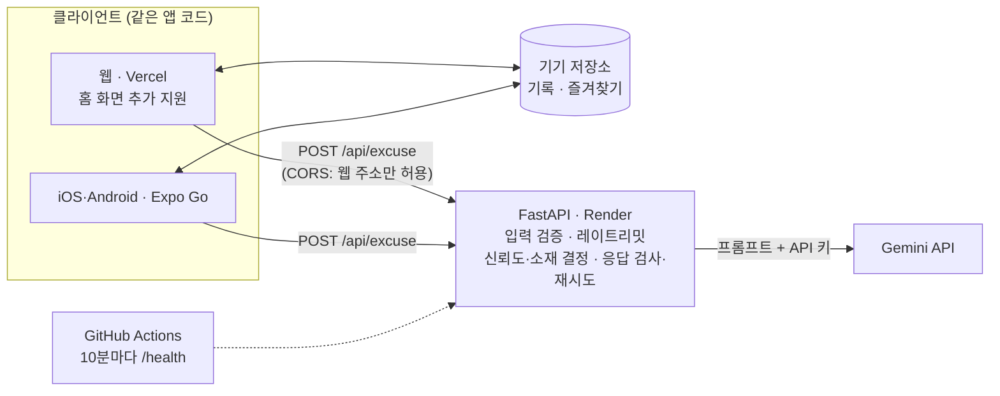

# 핑계생성기

> 상황·황당함 레벨·말투만 고르면, LLM이 웃기고 그럴듯한 핑계와 "신뢰도 점수"를 만들어 주는 앱

**🔗 바로 써보기: https://excuse-generator-app.vercel.app**
설치 없이 브라우저에서 열고, 휴대폰에서는 "홈 화면에 추가"를 누르면 앱처럼 쓸 수 있습니다.

Expo(React Native) 앱 · FastAPI 서버 · Gemini API로 만든 1인 풀스택 프로젝트입니다. 하나의 앱 코드로 iOS·Android(Expo Go)와 웹을 함께 지원합니다.

| 홈 | 결과 | 기록 | 다크 모드 |
| --- | --- | --- | --- |
|  |  |  |  |

## 주요 기능

- **황당함 레벨 1~10**: 현실적(1~3) → 수상함(4~6) → 황당(7~9) → 우주적(10). 레벨 1과 10의 결과가 확연히 다르다
- **말투 5종**: 공손한 직장인체 · 사극체 · 급식체(유행어 포함) · 뉴스 앵커체 · 발표자(학회)체
- **신뢰도 게이지**: 0~100% 점수와 그 점수에 어울리는 한 줄 코멘트
- **다시 뽑기**: 직전 핑계와 소재·전개가 겹치지 않게 다시 생성
- **복사·공유**: OS 공유 시트로 카카오톡 등에 바로 전송 (공유 시트가 없는 PC 브라우저는 복사로 대신)
- **기록·즐겨찾기**: 최근 20개 자동 저장, 별표한 핑계는 무제한 보관 (기기에만 저장, 로그인 없음)
- 다크 모드, 잠든 무료 서버 자동 깨우기, 오프라인·서버 장애 시 안내 문구

## 아키텍처



| 영역 | 기술 |
| --- | --- |
| 앱 | Expo SDK 57, TypeScript(strict), expo-router, AsyncStorage, expo-clipboard |
| 서버 | Python, FastAPI, Pydantic v2, uvicorn |
| LLM | Gemini API (google-genai SDK, `gemini-3.5-flash-lite`) |
| 배포 | Render(서버, Singapore) · Vercel(웹) · GitHub Actions(keep-alive) |
| 테스트 | pytest + FastAPI TestClient 62개 (LLM은 가짜 함수로 대체) |

## 핵심 설계 결정

### 1. API 키는 서버에만

앱 번들에 들어간 값은 누구나 꺼내 볼 수 있습니다(`EXPO_PUBLIC_` 환경변수도 빌드 때 코드에 그대로 들어감). 그래서 앱은 서버 주소만 알고, LLM 호출과 키는 서버가 전담합니다. 덕분에 레이트리밋·입력 검증·프롬프트 수정도 앱을 다시 배포하지 않고 서버 한 곳에서 할 수 있습니다. 로그에는 사용자가 입력한 텍스트와 키를 남기지 않습니다.

### 2. 랜덤이 필요한 결정은 LLM이 아니라 서버가

처음에는 신뢰도와 소재까지 LLM에게 맡겼더니, 범위를 줘도 매번 가운데 숫자(85 / 45 / 1)만 고르고 프롬프트 예시 장면(버스 15분, 동전 87개, 평행우주)을 그대로 반복했습니다. LLM은 "고르게 랜덤"을 못 하지만 코드는 정확히 합니다.

- **신뢰도**: 서버가 레벨별 범위(1~3: 70~95 … 10: 0~5)에서 뽑아 넘기고, LLM은 그 점수에 맞는 코멘트만 쓴다
- **소재·과장 방법·유행어**: 레벨 구간별 후보 목록에서 서버가 하나씩 골라 넘긴다. 프롬프트에는 장면 예시를 빼고 원칙만 남겼다
- 결과: 레벨 1을 10번 생성하면 버스 지각 5/5 → 0/10(8가지 소재), 레벨 8에서 레벨 5처럼 밋밋한 결과 5/10 → 0/10

### 3. 프롬프트 규칙 + 서버 검사 + 고칠 점을 알려주는 재시도

규칙을 프롬프트에 적어도 확률적으로 새어 나왔습니다(공손체에 "…사옵니다", 코멘트에 "48점짜리", "세종대왕" 등장). 그래서 응답을 서버가 정규식으로 한 번 더 검사합니다.

```text
Gemini 응답 → JSON 파싱 → Pydantic 검증(길이) → 점수 언급? 말투 섞임? 실존 인물? 비속어?
           → 걸리면 "무엇을 어겼는지" 덧붙여 1회 재시도 → 또 실패하면 502 (재시도 포함 15초 제한)
```

같은 프롬프트로 재시도하면 같은 실수를 반복해(급식체 레벨 10에서 5번 중 2번 최종 실패) 재시도 때 고칠 점을 알려주도록 바꿨습니다. 정규식으로 모든 경우를 막을 수는 없어, 프롬프트 규칙을 1차 방어선으로 두고 서버 검사는 실제로 자주 새던 패턴만 막습니다.

### 4. 무료 인프라의 제약을 코드로 보완

- **잠드는 서버**: Render 무료 서버는 15분 무요청 시 잠들고 깨는 데 약 1분 걸린다. GitHub Actions가 10분마다 깨우고, 그래도 잠들어 있으면 앱이 첫 요청 전에 `/health`로 깨우며 "서버를 깨우는 중이에요"를 보여준다
- **프록시 뒤 레이트리밋**: 프록시 주소로는 모든 사용자가 한도를 같이 쓰게 되어, `X-Forwarded-For`의 맨 뒤 값(프록시가 붙인 실제 IP)으로 구분한다. 맨 앞 값은 조작 가능해서 쓰지 않는다
- **CORS**: 브라우저 호출은 배포된 웹 주소만 허용한다 (네이티브 앱은 Origin을 보내지 않아 영향 없음)

## 직접 실행해 보기

```bash
# 서버 (server/.env에 GEMINI_API_KEY 필요)
cd server && python -m venv .venv && .venv/Scripts/activate   # macOS/Linux: source .venv/bin/activate
pip install -r requirements.txt && uvicorn main:app --host 0.0.0.0 --port 8000

# 앱 (app/.env에 EXPO_PUBLIC_API_URL=http://<노트북 IP>:8000)
cd app && npm install && npx expo start        # 웹으로 보기: npx expo start --web
```

자세한 실행·배포 방법과 문제 해결은 [docs/SETUP.md](docs/SETUP.md)에 있습니다.

## 문서

| 문서 | 내용 |
| --- | --- |
| [PRD.md](PRD.md) | 요구사항, 마일스톤(M1~M7), 인수 기준 |
| [DECISIONS.md](DECISIONS.md) | 구현 중 내린 결정과 이유 (한 줄씩) |
| [docs/DEVELOPMENT.md](docs/DEVELOPMENT.md) | 개발 기록: 마일스톤별 진행, 프롬프트 튜닝 과정과 수치, 배포 중 겪은 문제 |
| [docs/SETUP.md](docs/SETUP.md) | 로컬 실행, Render·Vercel 배포, 문제 해결, 폴더 구조 |
